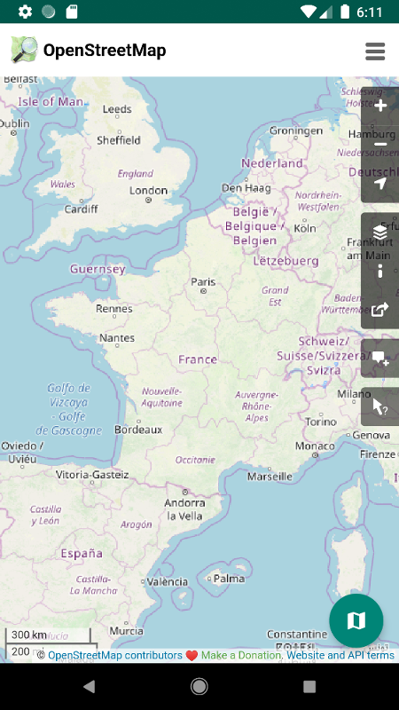
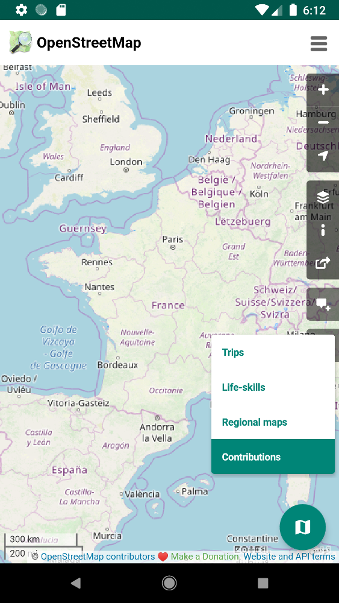
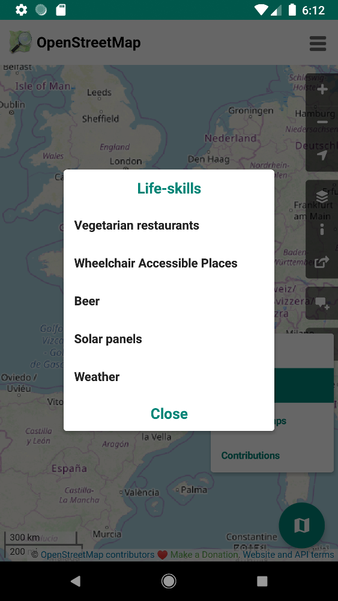
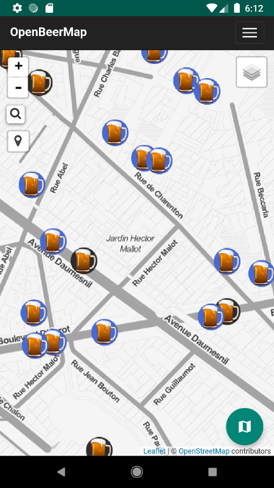

# OpenMaps 

A simple client to display maps from Open Street Maps

[Download the apk - v1.0.4](https://framadrive.org/s/xak7f4rjMkYdWRd)

&nbsp;&nbsp;&nbsp;&nbsp;&nbsp;&nbsp;
&nbsp;&nbsp;&nbsp;&nbsp;&nbsp;&nbsp;
&nbsp;&nbsp;&nbsp;&nbsp;&nbsp;&nbsp;
&nbsp;&nbsp;&nbsp;&nbsp;&nbsp;&nbsp;

Idea from [@Bristow_69@framapiaf.org](https://framapiaf.org/@Bristow_69)