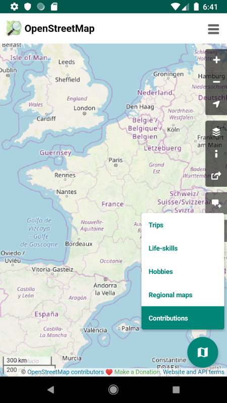
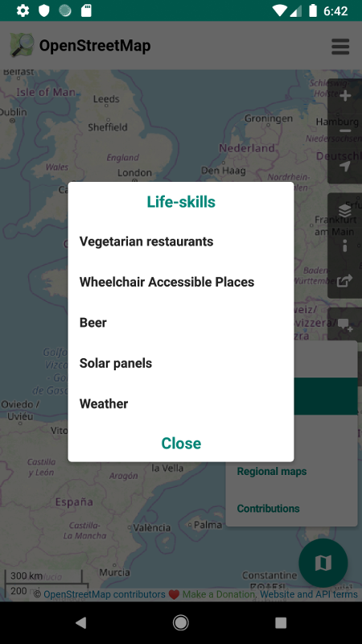

# OpenMaps  

A simple client to display maps from [OpenStreetMap](https://www.openstreetmap.org).

[Download the apk - v1.0.4](https://framadrive.org/s/xak7f4rjMkYdWRd)

&nbsp;&nbsp;&nbsp;&nbsp;&nbsp;&nbsp;
&nbsp;&nbsp;&nbsp;&nbsp;&nbsp;&nbsp;
&nbsp;&nbsp;&nbsp;&nbsp;&nbsp;&nbsp;
&nbsp;&nbsp;&nbsp;&nbsp;&nbsp;&nbsp;

Idea from [@Bristow_69@framapiaf.org](https://framapiaf.org/@Bristow_69)

Translations are done with [Crowdin](https://crowdin.com/project/openmaps), if a language is missing, please open an issue.